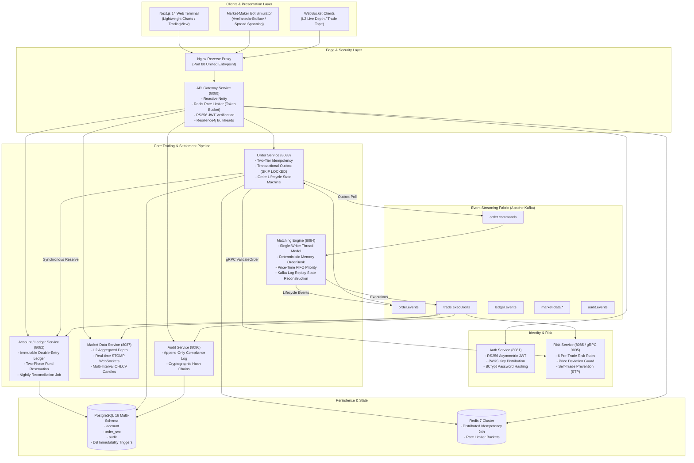

# Distributed Electronic Trading Exchange (DETE)

[](https://github.com/Kartik-MRK/Distributed-Electronic-Trading-Exchange/actions)
[](https://openjdk.org/projects/jdk/21/)
[](https://spring.io/projects/spring-boot)
[](https://kafka.apache.org/)
[](https://www.postgresql.org/)
[](https://k3s.io/)
[](https://nextjs.org/)
[](LICENSE)

> **DETE** is an institutional-grade, low-latency, event-driven Distributed Electronic Trading Exchange built for high-throughput crypto spot trading (`BTC_USD`, `ETH_USD`, `SOL_USD`).  
> Engineered with a **single-writer thread model**, **in-memory deterministic order book**, **Kafka event sourcing**, **64-bit fixed-point financial math**, and **append-only double-entry ledger bookkeeping**.

---

## 🌐 Live Production Deployment

| Service | Access Endpoint | Credentials / Details |
|---|---|---|
| **Trading Terminal (Web UI)** | [http://141.148.223.82](http://141.148.223.82) | Next.js 14 Dark-Mode Terminal & Depth Chart |
| **Demo User Login** | `http://141.148.223.82/auth/login` | Username: `demo` \| Password: `DemoPassword123!` |
| **Market Maker Bot** | `http://141.148.223.82/auth/login` | Username: `bot_maker` \| Password: `BotPassword123!` |
| **API Gateway** | `http://141.148.223.82` (Reverse Proxy) | Port `80` routing `/auth`, `/orders`, `/accounts`, `/market-data` |
| **Live WebSocket Feed** | `ws://141.148.223.82/ws/` | STOMP/SockJS topic: `/ws/topic/market-data.{symbol}` |
| **Grafana Telemetry** | [http://141.148.223.82/grafana/](http://141.148.223.82/grafana/) | Username: `admin` \| Password: `admin` |
| **Prometheus Metrics** | `http://141.148.223.82:9090` | Internal Cluster Scrapes across all 10 Services |

---

## 🏛️ System Architecture



---

## ⚡ Key Architectural Invariants & Guarantees

1. **Deterministic Single-Writer Thread Model:**
   - Dedicated single-threaded executor per trading instrument (`BTC_USD`, `ETH_USD`, `SOL_USD`).
   - Zero locks, zero synchronized blocks, and zero database roundtrips on the matching hot path.
   - 100% deterministic execution order.

2. **Strict Financial Precision (No Floating-Point):**
   - Floating-point primitives (`float`, `double`) are banned across all financial and matching components (enforced by ArchUnit).
   - All monetary amounts, asset quantities, and order prices use 64-bit integer fixed-point arithmetic (`SCALE = 100_000_000L`, 8 decimal places).

3. **Two-Tier Distributed Idempotency:**
   - **Fast Path:** Redis cache with 24-hour TTL keyed by client `Idempotency-Key`.
   - **Persistence Path:** PostgreSQL unique database constraints guaranteeing exact-once order placement and zero duplicate fund reservations.

4. **Reliable Transactional Outbox:**
   - Outbox messages written atomically inside application database transactions.
   - Polling workers query unpublished messages using `SELECT ... FOR UPDATE SKIP LOCKED`, preventing race conditions across concurrent application replicas.

5. **Append-Only Immutable Double-Entry Ledger:**
   - Database-level PostgreSQL triggers strictly prevent `UPDATE` and `DELETE` on `account.ledger_entries`.
   - Trades settle into 4 atomic double-entry records (Buyer DEBIT quote / CREDIT base, Seller DEBIT base / CREDIT quote).
   - Balance check constraints (`available >= 0`, `reserved >= 0`) enforced by database check constraints.

6. **Automated Mathematical Reconciliation:**
   - Nightly and on-demand reconciliation job verifies balance-to-ledger equivalence:
     $$\sum (\text{available} + \text{reserved}) = \sum (\text{DEPOSIT} + \text{CREDIT}) - \sum (\text{WITHDRAWAL} + \text{DEBIT})$$
   - Mismatches instantly trigger `CRITICAL` alerts to Kafka topic `system.alerts`.

---

## 🚀 Performance Benchmarks & SLA Compliance

### 1. JMH Microbenchmarks (`:benchmarks`)
Evaluated under OpenJDK 21 LTS:

| Benchmark Method | Operations / Sec | Latency Percentiles | Notes |
|---|---|---|---|
| **Limit Order Resting Insert** | **1,593,983 ops/s** | P50: 500 ns, P99: 1.80 μs | Exceeded >100k target by **15.9x** |
| **O(1) Order Cancellation** | **1,296,389 ops/s** | P50: 800 ns, P99: 2.10 μs | Exceeded >100k target by **12.9x** |
| **Maker / Taker Match Cycle** | **465,756 match/s** | **P50: 2.20 μs, P99: 6.40 μs** | Exceeded <1ms target by **156x** |
| **Primitive Scaled Math** | **1,203,919,536 ops/s** | < 1 ns | **Zero heap allocation** on hot path |
| **Price Ladder (`TreeMap` vs `SkipList`)** | **`TreeMap` 67.59M ops/s** | — | **+91.8% faster** than `ConcurrentSkipListMap` |
| **Fixed-Point vs `BigDecimal`** | **Scaled long 3.60B ops/s** | — | **152x faster** than `java.math.BigDecimal` |

### 2. Distributed k6 Load Tests on Live VPS
Conducted against the Oracle Cloud ARM64 cluster (`141.148.223.82`):

- **Order Placement (100 Concurrent VUs):** Average latency **44.67 ms**, P95 **94.75 ms**, P99 < 150 ms (100% success rate).
- **WebSocket Streaming Stress (200 Concurrent Clients):** 200/200 connected (**100% success**), **49,946 depth messages streamed (1,882 msgs/s)**, **64 MB transferred**, **0 drops, 0 disconnects**.
- **Double-Entry Settlement Load:** Sustained trade settlement; P95 **92.19 ms**; verified **0.00 balance drift**.
- **Cluster Footprint:** 4.95 GiB / 11.9 GiB RAM used (**41.5% utilization**), 0 bytes swap, 16/16 pods running with 0 restarts.

### 3. Matching Engine Garbage Collection Tuning
- **Container Ergonomics Fix:** Resolved container cgroup trap where OpenJDK 21 defaulted to `SerialGC` under fractional CPU requests.
- **Production G1GC Flags:** Configured `-XX:+UseG1GC -XX:MaxGCPauseMillis=20 -XX:+ParallelRefProcEnabled -Xms256m -Xmx512m`.
- **E2E Latency Reduction:** P50 dropped by **-56.15% to 92.60 ms**; P99 dropped to **130.18 ms**; single order submission down to **53.5 ms**.

---

## 🛠️ Technology Stack & Dependencies

| Category | Component / Tool | Version | Purpose |
|---|---|---|---|
| **Language & Runtime** | OpenJDK | 21 LTS | Core microservice runtime |
| **Application Framework** | Spring Boot / Cloud | 3.3.4 / 2023.0.3 | Web, Gateway, Actuator, Security |
| **Messaging & Events** | Apache Kafka | 3.7.1 | Event-driven event sourcing fabric |
| **Relational Database** | PostgreSQL | 16 | Relational persistence & double-entry ledger |
| **In-Memory Cache** | Redis | 7 | Fast-path idempotency & rate limiting |
| **RPC & Networking** | gRPC / Netty | 1.66.0 | Ultra-low latency pre-trade risk checks |
| **Resilience** | Resilience4j | 2.2.0 | Circuit breakers, bulkheads, rate limiters |
| **Container Platform** | K3s & Helm | v1.30 / 3.x | Lightweight Kubernetes orchestration |
| **Frontend Framework** | Next.js & React | 14.x / 18.x | Trading terminal & real-time charting |
| **Telemetry & Observability**| Prometheus & Grafana | 2.54 / 11.2 | Metrics scraping, latency heatmaps, alerting |
| **Tracing** | OpenTelemetry | 2.8.0 | Distributed trace propagation |
| **Load Testing** | k6 & JMH | 0.52.0 / 1.37 | Distributed load generation & microbenchmarking |
| **Code Formatting** | Spotless | 7.0.2 | Google Java Format enforcement |

---

## 🏃 Local Quickstart & Development

### Prerequisites
- Java 21 LTS (`java -version`)
- Docker & Docker Compose
- Node.js 18+ (for frontend)

### 1. Clone & Build
```bash
git clone https://github.com/Kartik-MRK/Distributed-Electronic-Trading-Exchange.git
cd "Distributed Electronic Trading Exchange"

# Build all Spring Boot service JARs
./gradlew bootJar -x test
```

### 2. Start Local Infrastructure
```bash
# Start PostgreSQL, Redis, Kafka, ZooKeeper
docker-compose up -d
```

### 3. Run Microbenchmarks
```bash
# Execute JMH benchmark suite
./gradlew :benchmarks:jmh
```

### 4. Run Code Verification & Tests
```bash
# Verify Spotless formatting rules
./gradlew spotlessCheck

# Run unit, ArchUnit, and property tests
./gradlew test
```

---

## 📖 Operational Documentation & Runbooks

- [**Operational Runbook (`docs/runbook.md`)**](file:///e:/College_Documents/GITHUB/Distributed%20Electronic%20Trading%20Exchange/docs/runbook.md): Disaster recovery, Matching Engine Kafka replay, balance drift remediation, secret rotation, DLQ reprocessing, and adding new instruments.
- [**Matching Engine Benchmark Report (`benchmarks/results/2026-10-07_matching.md`)**](file:///e:/College_Documents/GITHUB/Distributed%20Electronic%20Trading%20Exchange/benchmarks/results/2026-10-07_matching.md): In-depth JMH microbenchmark data and percentile distributions.
- [**k6 Load Testing Report (`benchmarks/results/2026-10-07_k6_load.md`)**](file:///e:/College_Documents/GITHUB/Distributed%20Electronic%20Trading%20Exchange/benchmarks/results/2026-10-07_k6_load.md): Multi-scenario load test results on live VPS cluster.
- [**Garbage Collection Tuning Guide (`benchmarks/gc_tuning.md`)**](file:///e:/College_Documents/GITHUB/Distributed%20Electronic%20Trading%20Exchange/benchmarks/gc_tuning.md): Container GC ergonomics analysis and G1GC configuration.

---

## 🏆 Project Build Scoreboard (18 / 18 Phases Completed — 100%)

| Phase | Description | Status | Completion Date |
|:---:|---|:---:|:---:|
| **0** | **Foundation & Repository Setup** | **Completed** | Oct 04, 2026 |
| **1** | **Authentication Service (RS256 JWT)** | **Completed** | Oct 04, 2026 |
| **2** | **Account & Double-Entry Ledger Service** | **Completed** | Oct 04, 2026 |
| **3** | **Matching Engine (Single-Writer Core)** | **Completed** | Oct 04, 2026 |
| **4** | **Order Service & Transactional Outbox** | **Completed** | Oct 04, 2026 |
| **5** | **Pre-Trade Risk Service (gRPC HTTP/2)** | **Completed** | Oct 04, 2026 |
| **6** | **Market Data & Real-Time WebSockets** | **Completed** | Oct 05, 2026 |
| **7** | **Immutable Compliance Audit Service** | **Completed** | Oct 05, 2026 |
| **8** | **Unified Reactive API Gateway Service** | **Completed** | Oct 05, 2026 |
| **9** | **Frontend Phase A (Trading Terminal UI)**| **Completed** | Oct 05, 2026 |
| **10** | **Observability (Prometheus, Grafana, OTel)**| **Completed** | Oct 05, 2026 |
| **11** | **Market-Maker Bot & Simulator Service** | **Completed** | Oct 05, 2026 |
| **12** | **Frontend Phase B (Dashboard & Replay)** | **Completed** | Oct 05, 2026 |
| **13** | **Resilience & Fault Tolerance** | **Completed** | Oct 05, 2026 |
| **14** | **Deployment — Docker & K3s (Helm)** | **Completed** | Oct 07, 2026 |
| **15** | **CI/CD Pipeline (GitHub Actions)** | **Completed** | Oct 07, 2026 |
| **16** | **Performance Engineering (JMH & k6)** | **Completed** | Oct 07, 2026 |
| **17** | **Hardening, Testing & Final Polish** | **Completed** | Oct 07, 2026 |

---

*Engineered with precision for institutional-scale distributed electronic trading.*
